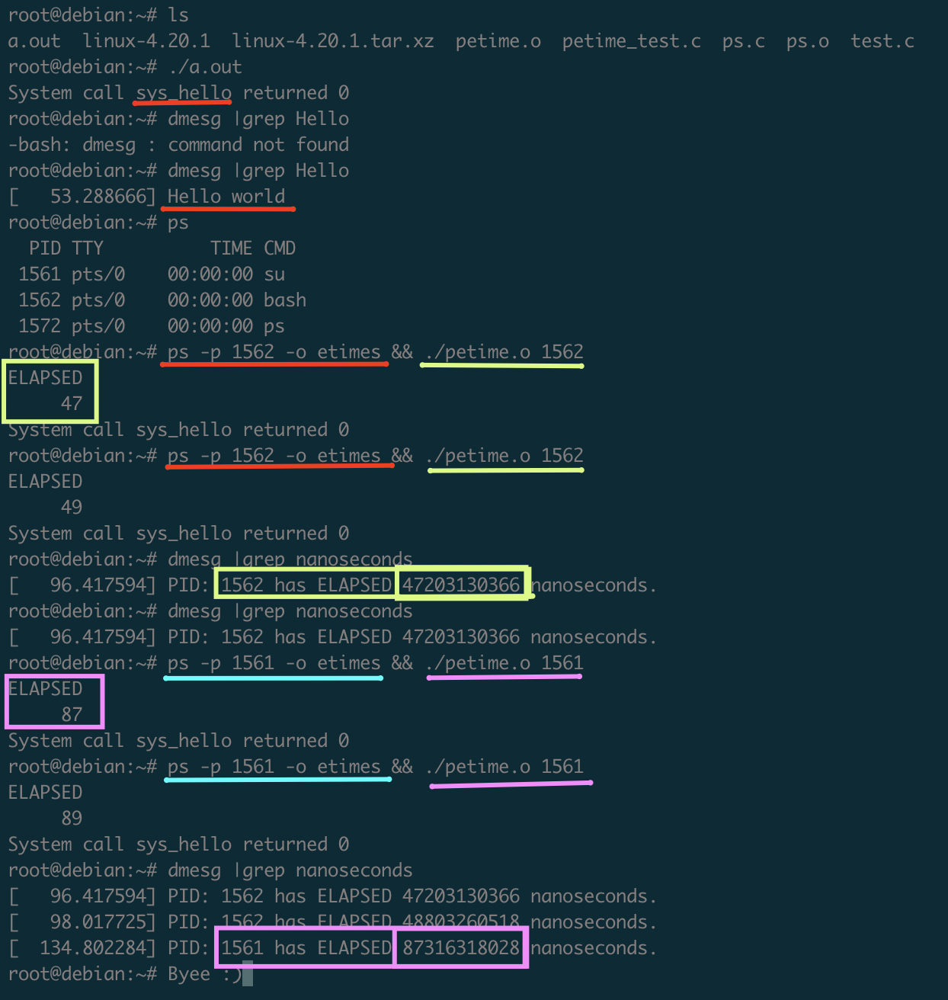

In my previous blog post 👇

[How to add system call (syscall) to the kernel, compile and test it?](https://overengineered.pro/how-to-add-system-call-syscall-to-the-kernel-compile-and-test-it/)

I described how to add syscall to the kernel, compile it and test it in detail. As promised, I now would like to describe how to create a syscall that prints out the elapsed time of a process with a given process id(PID).

*This task was my Operating Systems Programming Assignment.*

***In this blog post, unlike the previous one I will not go over into every detail, but point out the different parts of the process.***

After changing my current directory into kernel source files, I create another folder for my new function. You don't need to do it, but I prefer it this way.

```bash
mkdir petime && cd petime
```

***I will call my function `petime` short for process elapsed time.***

After I've created a C file which my code goes into.
```bash
vim petime.c
```

In my C code, I used `SYSCALL_DEFINE1` Macro from `<linux/syscalls.h>`. Because I needed to pass one integer argument to the function.

Also, you can use it for different argument counts. While argument count is `X`, the syntax will be like `SYSCALL_DEFINEX`.

Example:
```c
// For 2 parameters
SYSCALL_DEFINE2(function_name, int, first_int, int, second_int){
  // code goes here
}

// For 1 parameter
SYSCALL_DEFINE1(function_name, int, first_int){
  // code goes here
}

// For no-parameters
SYSCALL_DEFINE0(function_name){
  // code goes here
}
```

In addition to this Macro, I used the `task_struct` struct to get the process' start time and time elapsed since the boot with `ktime_get_ns()` function.

My C file which contains my syscall:

```c
#include <linux/kernel.h>
#include <linux/sched.h>
#include <linux/syscalls.h>

// Used this macro to be able to pass variables to the syscall
// It takes one integer, PID.
SYSCALL_DEFINE1(sys_petime, int, pid)
{
  // Using task_struct struct from sched.h, which has task's (process)
  // various data mostly about scheduling.
  struct task_struct *task;
  u64 start_time, elapsed;

  // Get process with PID.
  task = pid_task(find_vpid(pid), PIDTYPE_PID);
  // If process is not found.
  if (task == NULL)
  {
    // Print the error to the kernel buffer
    printk(KERN_INFO "Cannot find a process with that PID: %d\n", pid);
  }
  else
  {
    // Taken from "taskstats.c" source code (line 240-241).
    // Used the logic behind calculating the delta time in that source.
    // Get current nanoseconds since boot
    start_time = ktime_get_ns();
    // Difference
    elapsed = start_time - task->real_start_time;
    // Print result to the kernel buffer
    printk(KERN_INFO "PID: %d has ELAPSED %llu nanoseconds.", pid, elapsed);
  }

  // If nothing goes wrong, return 0 as successful
  return 0;
}
```

***`ktime_get_ns()` is like timestamp but it doesn't count from 1 Jan 1970 instead it counts nanoseconds since the Operating System boots.***

***`task->real_start_time` is the boot based start time of the process in nanoseconds.***

So as a result, the difference of total elapsed time since boot and the boot based start time of a process gives the elapsed time of a process.

Then, I've created `Makefile` file of my syscall:

```bash
vim Makefile
```

and inserted the default-ish configuration:

```
obj-y := petime.o
```

Now, I need to let my general `Makefile` know about my new folder and function.

Go back to the kernel source folder and edit `Makefile`:

```bash
cd .. && vim Makefile
```

Find the line with the `core-y`, it should be similar to this:

```
core-y		+= kernel/ certs/ mm/ fs/ ipc/ security/ crypto/ block/ hello/
```

`hello/` is the folder from [my previous blog post](https://overengineered.pro/how-to-add-system-call-syscall-to-the-kernel-compile-and-test-it).

I've added my new folder `petime` to the end of this line. Result should be looking like this:
```
core-y		+= kernel/ certs/ mm/ fs/ ipc/ security/ crypto/ block/ hello/ petime/
```

After saving the `Makefile`, we need to add our new syscall to the syscalls tables.

*I will describe the blog post according to 64-bit Operating System, if you want to do it on 32-bit OS, you can go back to my previous blog post find the details of the following steps for 32-bit OS.*

For 64-bit OS, I add my syscall to the end of my file(table):
```
549 64  petime  __64_sys_sys_petime
```

I've put `sys` 2 times, like `_sys_sys_` because my function name was already `sys_petime` but you need to prepend `__64_sys_` of the function name in this table, so result becomes `__64_sys_sys_petime`.

Then, we need to add our function signature to the syscalls header file `syscalls.h`.

```bash
vim include/linux/syscalls.h
```

Then, add the following line to the end of the document before the #endif statement:

```C
asmlinkage long sys_petime(int);
```

Now, we can compile it the same as our Hello World example.

After the, compilation we can test it with the following C code:

```c
#include <stdio.h>
#include <linux/kernel.h>
#include <stdlib.h>
#include <sys/syscall.h>
#include <unistd.h>

int main(int argc, char **argv)
{
  // Get args from terminal and call petime (get elapsed time) with that PID.
  long int helloCheck = syscall(549, atoi(argv[1]));
  printf("System call sys_petime returned %ld\n", helloCheck);
  return 0;
}
```

And the result is such that:

