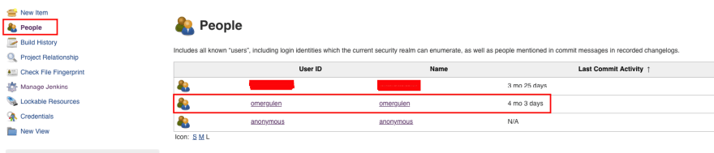
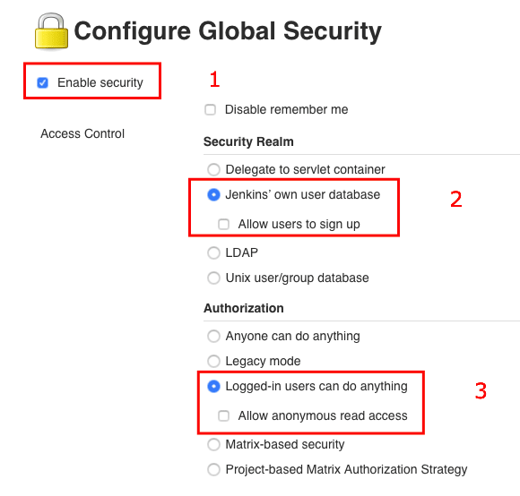

Several months ago I've created a development environment for my side project [iytemenu](https://iytemenu.me). Yet, after a little development interval, I became too busy to develop the project and took a break. Then, this week my finals are done and I kinda have a free time to spend for my side projects, but when I came back I faced that I've lost my Jenkins credentials. Resetting the whole Jenkins logs/DB was too costly so I've researched and tried to find a better way. After some digging, I've found a way and I wanted to share with the community while I have the time to do.

## Let's get started

_NOTE: I think some versions have the Jenkins name as first letter capital. So use `Jenkins` instead of `jenkins` if you can't find the lower case one. Apply this in the following steps of the tutorial._

- The first step is making an SSH connection into your host.
```bash
ssh username@host
```

- Then, we need to edit the Jenkins config file. It is placed under this path:

```
/var/lib/jenkins/config.xml
```

To edit this config file I prefer using `vi` because other editors may not be installed into the host.

```bash
vi /var/lib/jenkins/config.xml
```

- Once you've successfully opened the file in your favorite editor, we need to find `<useSecurity>` tag and set it's value to `false`.


- After setting the value, you can use save and exit from the editor.


- Now, we need to restart the Jenkins service.

```
systemctl restart jenkins
```

PS: If you are not `root` you may need `sudo` for this operation.

- After the restart, you can check the status of the service by:

```
systemctl status jenkins
```

- Now, you can go to the Jenkins dashboard. You will not need any credentials, and the `logged in user` section will be blank since you are now an Anonymous user.


- Then, navigate to `People` on the left panel and remove old users by following the steps in the screenshots.




PS: Some versions don't remove the old users totally, instead it shows an anonymous user (you) with other users. This should be enough to continue to the next steps if it doesn't start from the beginning and remove all users.

- After removing the old users, navigate to `Manage Jenkins` page from the left panel, and go to the `Configure Global Security` section by clicking.


- Tick `enable security`

- In the `Security Realm` section, you will;
-- Select `Jenkins' own user database`
-- Untick the `Allow users to sign up`

- In the `Authorization` section, you will;
-- Select `Logged-in users can do anything`
-- Untick the `Allow anonymous read access`

Your settings should be looking like this:



And do not forget to `save` the changes.


- On successful save, it will redirect you to the `Create First Admin User` page.

You will set the credentials of your new `admin` user here.

- Once, you've completed the fields you can click to the `Create First Admin User` button.


- Jenkins will redirect you to the `Success` page if everything goes fine. You can see your new admin user's username or name on the right top corner. And when you try to login with your credentials it won't be a problem anymore.


Thanks for reading.
