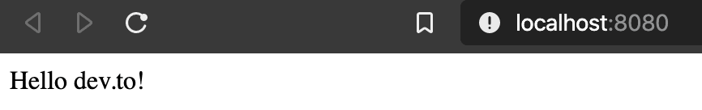
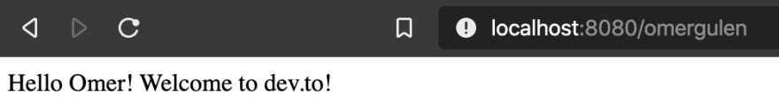

I've decided to write about this tutorial after I struggled while I was coding one of my web apps for fun. It was a simple chart for the web but it was collecting data on a Telegram Bot. Held the data in MongoDB and prepared a quick API for fetching the data but got many problems on the way and SSL Certificate was one of them, and I wanted to do it this way.

***WARNING: IT IS NOT THE BEST WAY***

So in this tutorial, I will go through my mistakes & problems and my solutions to them, if you want to skip straight to the short version, you can [continue from here](#1-ssh-into-the-server).

***In this article I will not mention MongoDB related code or problems.***

## 1. Creating My Basic API Server with Express

In my projects, I prefer creating an `npm` or `yarn` environment after creating the project folder.

So, I've done it with the following commands:

```bash
mkdir my-project && cd my-project
yarn init
```
Just spammed `Enter` after `yarn init` and created the project environment with default settings.

*(I prefer `yarn` over `npm` if there are no obstacles to use it.)*

Then, I installed `express` to my project, locally with:

```bash
yarn add express
```

You can also use:

```bash
npm install express
```


Then, I created my single source file `index.js` and inserted these lines below:

```jsx
// import express
const express = require('express');

// create new express app and assign it to `app` constant
const app = express();

// server port configuration
const PORT = 8080;

// create a route for the app
app.get('/', (req, res) => {
  res.send('Hello dev.to!');
});

// server starts listening the `PORT`
app.listen(PORT, () => {
  console.log(`Server running at: http://localhost:${PORT}/`);
});
```

So far, I imported the `express` package, created an instance of it and assigned it to the `app`. Set my `PORT` variable, and created a route for `endpoint` handling in my API Server and called `app.list(PORT, callback())` method to start my server listening on the specified port.

Went back to my terminal and executed the command below in my project directory:

```bash
node index.js
```
which starts my server and logs to the console as below:
```
Server running at http://localhost:8080/
```

Then, I switched to my browser and browsed to `http://localhost:8080/` and the following page appeared:



So far so good. My app is correctly listening to my port.
Afterwards, I've tested my initial trial works and wanted to test if I can handle more endpoints. So I've just added another `route` to my code.

```jsx
app.get('/omergulen', (req, res) => {
  res.send('Hello Omer! Welcome to dev.to!');
});
```

I expect this to work only when I entered `/omergulen` endpoint in my browser.

So, I've stopped my running server with `Control+C` and re-started again, since hot-reloading is not inherent with how I run my app. Switched to my browser and visited the `http://localhost:8080/omergulen` and it was working, to be sure I re-visited the `http://localhost:8080/` and it was also working as expected.



## 2. Why and how to use middleware with Express?

After my first API server deploys, I switched to my web app project and sent a fetch request to my API endpoint.

```jsx
fetch('MY_API_URL')
  .then(function (response) {
    console.log(response);
    return response.json();
  })
  .then(...);
```

Nothing was happening in my DOM, but the console message was frustrating.

```
Access to fetch at 'MY_API_URL' from origin 'http://localhost:3000' has been blocked by CORS policy: No 'Access-Control-Allow-Origin' header is present on the requested resource. If an opaque response serves your needs, set the request's mode to 'no-cors' to fetch the resource with CORS disabled.

App.js:34 Cross-Origin Read Blocking (CORB) blocked cross-origin response MY_API_URL with MIME type application/json. See https://www.chromestatus.com/feature/5629709824032768 for more details.
```

After doing some quick research, I've realized I needed to configure my API Server according to the `CORS Policy`.

First, I've added added `mode: 'cors'` to my fetch request:

```jsx
fetch('MY_API_URL', {
  mode: 'cors'
})
.then(function (response) {
  console.log(response);
  return response.json();
})
.then(...);
```

It was alone no use to my problem. Then, I've added my `cors` middleware to my API server with only two lines actually.

After installing `cors` package with:

```bash
yarn add cors
```

I just added these lines to my code:
```jsx
// import `cors` package
const cors = require('cors');

// use middleware
app.use(cors());
```

And after running with these configurations, my problem was solved, for now.

## 3. How to serve Express API Server as HTTPS?

To deploy, I moved my project to my VPS and redirected my `my_api_url` domain to this VPS. In that way I've put a small layer of abstraction to my server IP, Also, I wouldn't need to type my IP everywhere instead I could use my own domain with fancy subdomains like `api.omergulen.com`.

In this step, I first tried to deploy it without certification on HTTP.

```
[blocked] The page at 'https://my_web_app'  was loaded over HTTPS but ran insecure content from 'http://my_api_url': this content should also be loaded over HTTPS.
```

Yet, my webserver was being server on Firebase Hosting and it was served as https, sending a request from `HTTPS to HTTP` is called [Mixed Content](https://developers.google.com/web/fundamentals/security/prevent-mixed-content/what-is-mixed-content). And it is not allowed to.

So, I just put `s` at the beginning of the URL :))

`https://my_api_url` as you can guess, it didn't work either.

```
GET https://my_api_url net::ERR_SSL_PROTOCOL_ERROR
```

Then, after doing focused research I've realized that I needed to create a certificate with a Certificate Authority. Many Certificate Authorities were paid but not [Let's Encrypt](https://letsencrypt.org/).

*Let’s Encrypt is a free, automated, and open Certificate Authority.*

If you have shell access to your server, it suggests you use [certbot](https://certbot.eff.org/).

In the `certbot` website, I chose:

My HTTP website is running `None of the above` on `Ubuntu 16.04 (xenial)` which was fitting to my case.

Before starting they want you to be sure to have:
- comfort with the command line
- and an HTTP website (API Server in my case)
- which is `online`
- and serving on HTTP port (`80`)
- which is hosted on a `server`
- which you can access via `SSH`
- with the ability to `sudo`

Then just apply the steps on the below:

### 1. SSH into the server

SSH into the server running your HTTP website as a user with sudo privileges.

### 2. Add Certbot PPA
You'll need to add the Certbot PPA to your list of repositories. To do so, run the following commands on the command line on the machine:

```bash
sudo apt-get update &&
sudo apt-get install software-properties-common &&
sudo add-apt-repository universe &&
sudo add-apt-repository ppa:certbot/certbot &&
sudo apt-get update
```

### 3. Install Certbot
Run this command on the command line on the machine to install Certbot.

```bash
sudo apt-get install certbot
```

### 4. Choose how you'd like to run Certbot
Are you ok with temporarily stopping your website?

***Yes, my web server is not currently running on this machine.***

Stop your web server, then run this command to get a certificate. Certbot will temporarily spin up a webserver on your machine.

```bash
sudo certbot certonly --standalone
```

***No, I need to keep my webserver running.***

If you have a web server that's already using port 80 and don't want to stop it while Certbot runs, run this command and follow the instructions in the terminal.

```bash
sudo certbot certonly --webroot
```

In this step, you need to insert your domain into the terminal such as `dev.to`. After that it will check your web server and look for specific files which it will create and in case of success it should print out like that:

```
Performing the following challenges:
http-01 challenge for my_api_url
Waiting for verification...
Cleaning up challenges

IMPORTANT NOTES:
 - Congratulations! Your certificate and chain have been saved at:
   /etc/letsencrypt/live/my_api_url/fullchain.pem
   Your key file has been saved at:
   /etc/letsencrypt/live/my_api_url/privkey.pem
   Your cert will expire on 2020-04-01. To obtain a new or tweaked
   version of this certificate in the future, simply run certbot
   again. To non-interactively renew *all* of your certificates, run
   "certbot renew"
 - If you like Certbot, please consider supporting our work by:

   Donating to ISRG / Let's Encrypt:   https://letsencrypt.org/donate
   Donating to EFF:                    https://eff.org/donate-le
```

**Important Note:**
To use the webroot plugin, your server must be configured to serve files from hidden directories. If `/.well-known` is treated specially by your webserver configuration, you might need to modify the configuration to ensure that files inside `/.well-known/acme-challenge` are served by the webserver.

## 4. Installing signed certificate to Express API Server

You'll need to install your new certificate in the configuration file for your API Server.

First, you need to install and import some modules:

```bash
yarn add https
```

```jsx
// import packages
const https = require('https');
const fs = require('fs');

// serve the API with signed certificate on 443 (SSL/HTTPS) port
const httpsServer = https.createServer({
  key: fs.readFileSync('/etc/letsencrypt/live/my_api_url/privkey.pem'),
  cert: fs.readFileSync('/etc/letsencrypt/live/my_api_url/fullchain.pem'),
}, app);

httpsServer.listen(443, () => {
	console.log('HTTPS Server running on port 443');
});
```

If you also want to maintain `HTTP` requests among the `HTTPS` requests, you can add the following lines, too:

```jsx
const http = require('http');

// serve the API on 80 (HTTP) port
const httpServer = http.createServer(app);

httpServer.listen(80, () => {
	console.log('HTTP Server running on port 80');
});
```

In the end your final API Server code will be something like that:

```jsx
// import required packages
const express = require('express');
const cors = require('cors');

const https = require('https');
const http = require('http');

const fs = require('fs');


const app = express();
app.use(cors());

// create new express app and save it as "app"
const app = express();
app.use(cors());

// create a route for the app
app.get('/', (req, res) => {
  res.send('Hello dev.to!');
});

// another route
app.get('/omergulen', (req, res) => {
  res.send('Hello Omer! Welcome to dev.to!');
});

// Listen both http & https ports
const httpServer = http.createServer(app);
const httpsServer = https.createServer({
  key: fs.readFileSync('/etc/letsencrypt/live/my_api_url/privkey.pem'),
  cert: fs.readFileSync('/etc/letsencrypt/live/my_api_url/fullchain.pem'),
}, app);

httpServer.listen(80, () => {
	console.log('HTTP Server running on port 80');
});

httpsServer.listen(443, () => {
	console.log('HTTPS Server running on port 443');
});
```

## 5. Automatic Renewal and Test of the Certificate

The Certbot packages on your system come with a cron job or systemd timer that will renew your certificates automatically before they expire. You will not need to run Certbot again, unless you change your configuration. You can test automatic renewal for your certificates by running this command:

```bash
sudo certbot renew --dry-run
```

The command to renew certbot is installed in one of the following locations:

```bash
/etc/crontab/
/etc/cron.*/*
systemctl list-timers
```

If you needed to stop your webserver to run Certbot, you'll want to edit the built-in command to add the `--pre-hook` and `--post-hook` flags to stop and start your web server automatically. For example, if your webserver is HAProxy, add the following to the `certbot renew` command:

```bash
--pre-hook "service haproxy stop" --post-hook "service haproxy start"
```
More information is available in the [Certbot documentation on renewing certificates](https://certbot.eff.org/docs/using.html?highlight=hooks#renewing-certificates).


***Confirm that Certbot worked***


To confirm that your site is set up properly, visit `https://yourwebsite.com/` in your browser and look for the lock icon in the URL bar. If you want to check that you have the top-of-the-line installation, you can head to https://www.ssllabs.com/ssltest/.

Well done! You have come to the end of this long tutorial.

After applying these steps you can finally go to your API Server URL and you should be seeing `Hello dev.to!`.

## *Thanks for reading*

